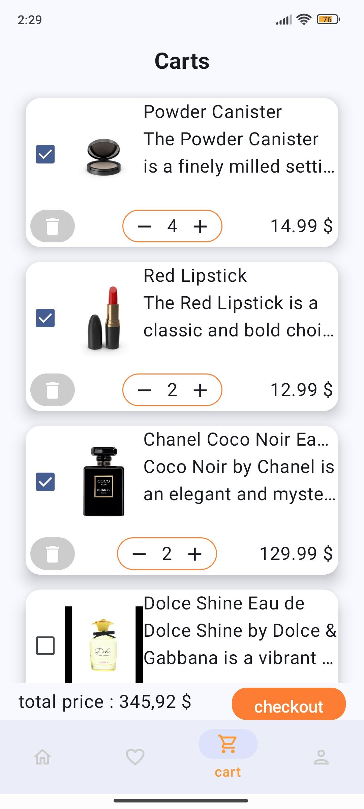
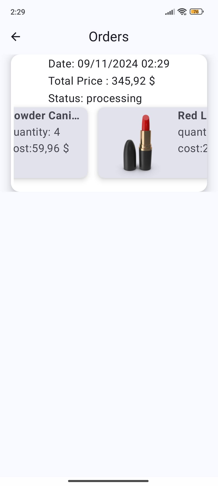
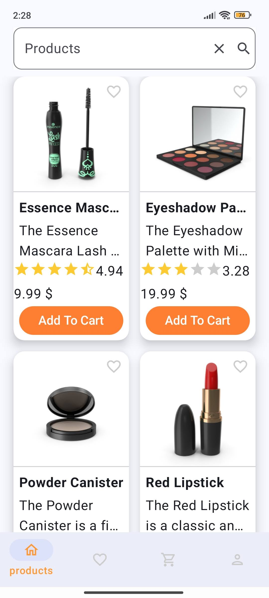
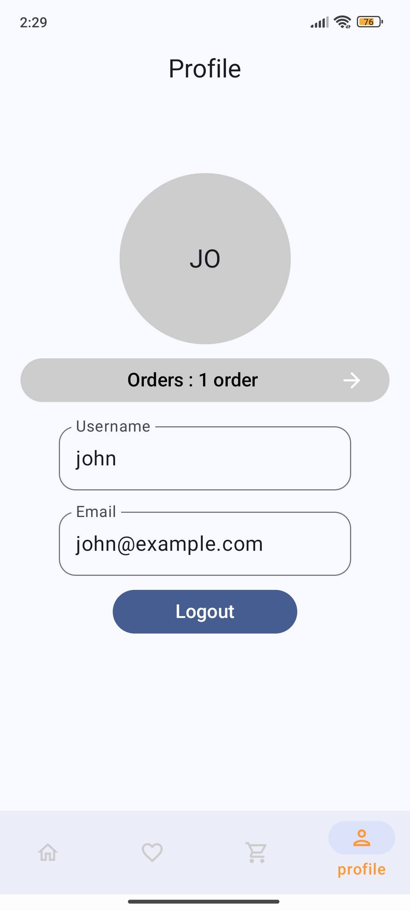

# EcomApp 🚀

**EcomApp** is a multi-module e-commerce application developed for practice purposes, showcasing various modern Android development practices and technologies. Product information (images, price, ratings, etc.) is sourced from [DummyJSON](https://dummyjson.com/).

## Features ✨

- **Coil Async Image Loading**: Efficient and fast image loading using [Coil](https://coil-kt.github.io/coil/).
- **StateFlow for UI State Management**: Manages UI state effectively with `StateFlow`.
- **Kotlin Coroutines**: Handles asynchronous operations and task management seamlessly.
- **Preferences DataStore**: Stores necessary data using preferencesdatastore .
- **Firebase Authentication & Firestore**: Integrates Firebase Auth for user authentication and Firestore for cloud-based data storage.
- **Room Database**: Provides local data caching with `Room Database`.
- **Custom SQL Queries in DAOs**: Offers more control over data with custom SQL queries in DAO interfaces.
- **Custom Pagination for UI**: Implements a custom pagination system for smooth data handling in the UI.
- **Data Sync** : Required data is synced between firebase and room.
- **Multi-Module Architecture**: Designed as a multi-module project for better manageability and scalability.
- **Hilt for Dependency Injection**: Manages dependencies efficiently using [Hilt](https://developer.android.com/training/dependency-injection/hilt-android).
- **Retrofit for Network Operations**: Handles network requests and data fetching using `Retrofit`.
- **MVVM and Clean Architecture**: Ensures a well-structured, testable codebase by following MVVM and Clean Architecture principles.
- **Jetpack Compose for UI**: Builds the UI with [Jetpack Compose](https://developer.android.com/jetpack/compose).

## Technologies Used 🛠️

- **Kotlin**
- **Jetpack Compose**
- **Hilt**
- **Retrofit**
- **Room Database**
- **Firebase Authentication & Firestore**
- **Coil**
- **Kotlin Coroutines**
- **StateFlow**
- **Preferences DataStore**

**Module Tree Structure**

📦 EcomApp

<ul>
  <li>📂 app</li>
  <li>📦 core
    <ul>
      <li>📂 common</li>
      <li>📂 data</li>
      <li>📂 database</li>
      <li>📂 datastore</li>
      <li>📂 domain</li>
      <li>📂 network</li>
    </ul>
  </li>
  <li>📦 feature
    <ul>
      <li>📂 cart</li>
      <li>📂 component</li>
      <li>📂 detail</li>
      <li>📂 favorites</li>
      <li>📂 login</li>
      <li>📂 products</li>
      <li>📂 profile</li>
      <li>📂 register</li>
    </ul>
  </li>
</ul>

    

## TODO 📝

- **Refactor `EcomRepositoryImpl` Class**: The `EcomRepositoryImpl` class is currently bulky. Plan to add two  helper classes: `LocalDataHelper` and `FirebaseHelper` for better modularity and readability.
- **Enhance Adaptive Layout**: Improve the adaptive layout to support various screen sizes and device types, ensuring a consistent user experience across all platforms.
- **Add usecases** : For sticking mvvm principles.

## Architecture Overview 🏗️

EcomApp follows the **MVVM (Model-View-ViewModel)** and **Clean Architecture** principles. This architectural approach enhances the app's testability, maintainability, and scalability. The project is divided into multiple modules, each serving a specific functionality to ensure a clear separation of concerns.

## Demo 📽️

Check out the app in action:

##Demo Video

[Demo Video](assets/video.mp4)

## Screenshots 📸

